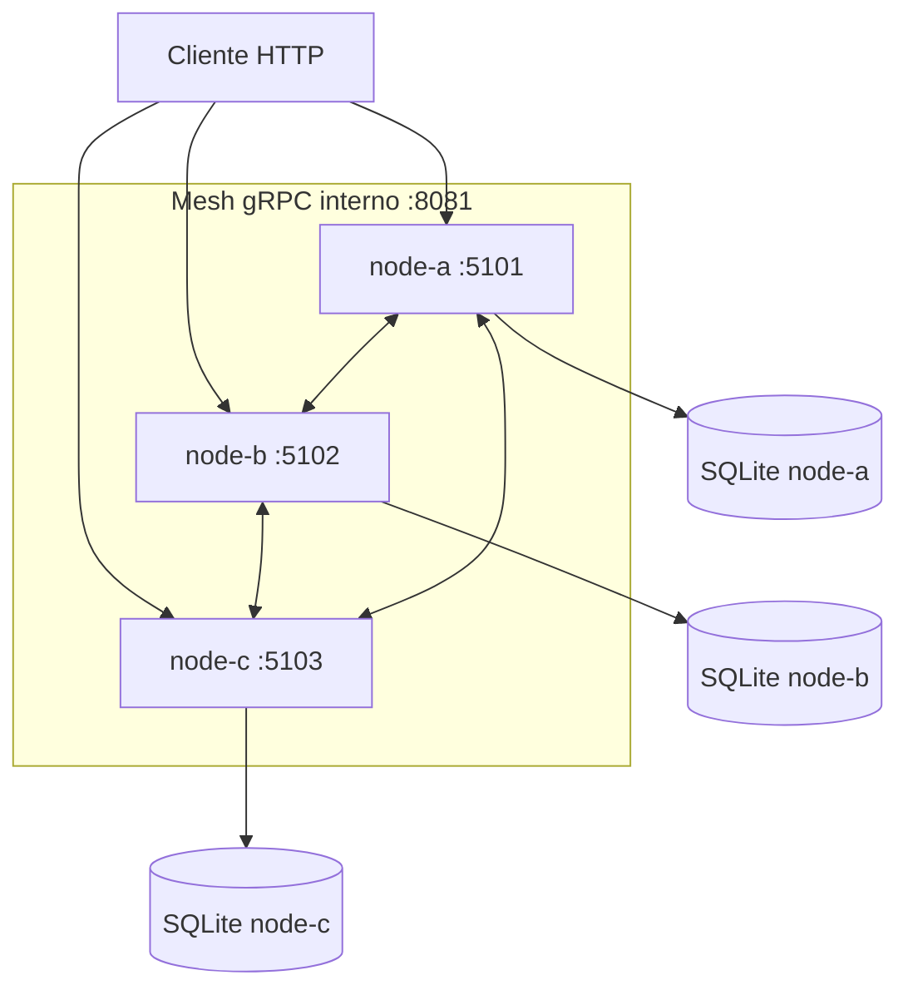

# SolidarityGrid

SolidarityGrid es una prueba de concepto en .NET 8 de una red distribuida de
procesadores de pagos. Tres nodos idénticos se coordinan directamente, sin
broker ni base de datos central, para completar un pago incluso si el nodo que
lo procesaba muere.

## Requisitos

- Docker Engine o Docker Desktop con Docker Compose.
- .NET 8 SDK únicamente para compilar y ejecutar las pruebas fuera de Docker.
- PowerShell o Bash para los scripts de automatización.

## Requisito mínimo: levantar con un comando

Desde la raíz del repositorio:

```bash
docker compose up --build
```

Este único comando:

- construye una imagen .NET 8 compartida;
- crea la red privada de Docker;
- levanta `node-a`, `node-b` y `node-c`;
- configura la identidad y los dos peers de cada nodo;
- crea un volumen y una base SQLite independiente por nodo;
- aplica automáticamente las migraciones;
- inicia heartbeats, procesamiento y health checks.

No requiere crear bases de datos, redes ni configuración manual. Para ejecutarlo
en segundo plano:

```bash
docker compose up --build -d
docker compose ps
```

Los tres servicios deben aparecer como `healthy`.

| Nodo | URL pública |
|---|---|
| node-a | http://localhost:5101 |
| node-b | http://localhost:5102 |
| node-c | http://localhost:5103 |

Para detener y eliminar también los datos de la demo:

```bash
docker compose down -v
```

## Local Pipeline de un solo comando

El pipeline integral construye la imagen, levanta los tres nodos, espera que
estén saludables, crea un pago, mata abruptamente al owner, verifica el
failover y limpia el entorno.

PowerShell:

```powershell
powershell -ExecutionPolicy Bypass -File .\scripts\run-poc.ps1
```

Bash:

```bash
bash ./scripts/run-poc.sh
```

Una ejecución correcta termina con resultados equivalentes a:

```text
New term: 2
New attempt: 2
Survivor node-x: Completed
Survivor node-y: Completed
PaymentCompleted events: 1
Old owner running: false
SUCCESS
```

Para conservar el entorno después de la demostración:

```powershell
.\scripts\run-poc.ps1 -KeepRunning
```

```bash
bash ./scripts/run-poc.sh --keep-running
```

Después se debe limpiar manualmente con `docker compose down -v`.

## Simulación de fallo sobre un clúster activo

Si el clúster ya fue iniciado con Docker Compose, el escenario de chaos puede
ejecutarse por separado:

```powershell
.\scripts\demo-failover.ps1
```

```bash
bash ./scripts/demo-failover.sh
```

La demo descubre dinámicamente el owner del pago y ejecuta `docker kill` sobre
ese contenedor durante el procesamiento. Luego confirma que:

- los supervivientes detectan al owner como `Unreachable`;
- el takeover ocurre después de expirar el lease;
- el nuevo owner usa un term superior;
- el pago queda `Completed` en ambos supervivientes;
- existe una sola completion principal observable;
- el quórum restante todavía acepta otro pago.

## Arquitectura



Cada nodo ejecuta el mismo código y conserva su propia base SQLite. El puerto
gRPC `8081` solo está disponible dentro de la red Docker; no se publica en el
host.

## Estrategia de coordinación

1. El cliente envía `POST /pay` a cualquiera de los tres nodos.
2. El receptor persiste el pago y obtiene una réplica durable remota: quórum
   2 de 3.
3. Un nodo adquiere ownership temporal mediante un lease y un term monotónico.
4. El procesamiento simulado tarda ocho segundos.
5. La finalización se replica en quórum antes de confirmarse localmente.
6. Si el owner muere, los heartbeats lo marcan `Unreachable`.
7. Después de expirar el lease, un superviviente adquiere ownership con un term
   superior y completa el pago.

Los terms y el fencing rechazan renovaciones o completions de owners obsoletos.
La clave `Idempotency-Key` evita crear un segundo pago cuando el cliente repite
la misma solicitud.

## API

| Método | Ruta | Propósito |
|---|---|---|
| `GET` | `/` | Información básica del nodo |
| `GET` | `/node` | Identidad y peers configurados |
| `POST` | `/pay` | Crear o reproducir idempotentemente un pago |
| `GET` | `/payments/{id}` | Consultar la copia local del pago |
| `GET` | `/health/live` | Liveness |
| `GET` | `/health/ready` | Readiness |
| `GET` | `/mesh/status` | Estado conocido de los peers |

Ejemplo:

```bash
curl -i http://localhost:5101/pay \
  -H "Content-Type: application/json" \
  -H "Idempotency-Key: DEMO-001" \
  -H "X-Correlation-ID: demo-correlation-001" \
  -d '{"amount":150000,"currency":"COP"}'
```

También se incluyen ejemplos en [SolidarityGrid.http](SolidarityGrid.http).

## Prueba manual con Postman

Primero levanta el clúster:

```bash
docker compose up --build -d
```

En Postman crea una petición `POST` a `http://localhost:5101/pay` con estos
headers:

```text
Content-Type: application/json
Idempotency-Key: POSTMAN-001
X-Correlation-ID: postman-001
```

Y este body JSON:

```json
{
  "amount": 150000,
  "currency": "COP"
}
```

La respuesta esperada es `202 Accepted` e incluye un `paymentId`. Después de
ocho a doce segundos, consulta el mismo identificador en los tres nodos:

```text
GET http://localhost:5101/payments/{paymentId}
GET http://localhost:5102/payments/{paymentId}
GET http://localhost:5103/payments/{paymentId}
```

Los tres nodos deben mostrar el pago como `Completed`. Repetir el mismo
`POST` con igual `Idempotency-Key` y body debe devolver el mismo pago. La
demostración automatizada del failover se realiza con `run-poc`; Postman es
opcional para explorar la API.

Al terminar:

```bash
docker compose down -v
```

## Logs

Los logs JSON permiten seguir la historia por `PaymentId`, `NodeId`,
`EventName` y `CorrelationId`:

```bash
docker compose logs --no-color
```

Durante el failover se observan la detección del nodo caído, el takeover, el
nuevo term y la finalización del pago. Los fallos esperados de un peer no
generan un stack trace por cada heartbeat.

## Validación técnica

El pipeline local de calidad ejecuta restore, format, build, validación de
migraciones, pruebas, validación de Compose y Docker build.

PowerShell:

```powershell
.\scripts\local-ci.ps1
```

Bash:

```bash
bash ./scripts/local-ci.sh
```

También se pueden ejecutar solamente las pruebas:

```bash
dotnet test ./SolidarityGrid.sln
```

`local-ci` valida el repositorio sin iniciar el escenario chaos. `run-poc`
demuestra el ciclo distribuido completo.

Las decisiones de diseño están documentadas en [docs/adr](docs/adr).
