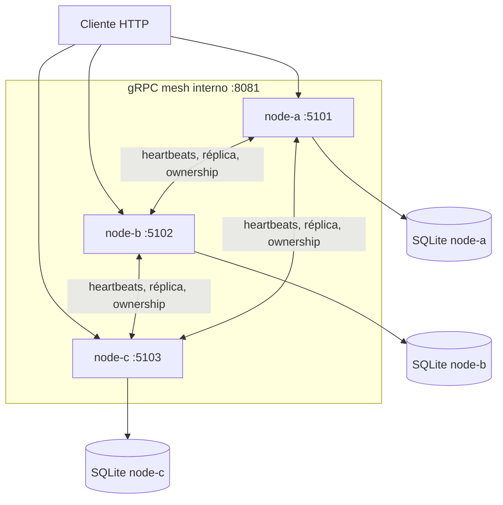

# SolidarityGrid

SolidarityGrid es una prueba de concepto de procesamiento resiliente de pagos
con .NET 8. El repositorio prioriza una entrega reproducible: tres nodos
idénticos, una demo de failover de un comando, pruebas automatizadas y ninguna
dependencia de infraestructura externa.

## Problema

Un cliente puede enviar un pago a cualquiera de tres nodos. Cada pago tarda
ocho segundos en procesarse y debe sobrevivir a la caída abrupta de su owner.
Los nodos se coordinan directamente, sin broker ni base de datos central.

Antes de procesar, el pago queda durable en quorum 2 de 3. Si el owner muere,
los heartbeats lo marcan `Unreachable`; al expirar su lease, un superviviente
adquiere ownership con un term superior, repite el trabajo y completa el mismo
pago de forma idempotente.

## Quick start

Requisitos: Docker Engine con Docker Compose. Para levantar el cluster:

```bash
docker compose up --build -d
```

Ejecuta la demo de failover desde PowerShell:

```powershell
powershell -ExecutionPolicy Bypass -File .\scripts\demo-failover.ps1
```

O desde Bash:

```bash
bash ./scripts/demo-failover.sh
```

Al terminar:

```bash
docker compose down -v
```

El cliente puede enviar `POST /pay` a cualquiera de los puertos públicos
5101–5103. La demo usa node-a como receptor por simplicidad, pero descubre el
owner real antes de detenerlo.

## Demo integral de un solo comando

Los scripts integrales parten de un entorno limpio, construyen una única imagen,
levantan los tres nodos, esperan health, ejecutan el failover y eliminan
contenedores, red y volúmenes incluso si ocurre un error.

PowerShell:

```powershell
powershell -ExecutionPolicy Bypass -File .\scripts\run-poc.ps1
```

Bash en Linux o Git Bash:

```bash
bash ./scripts/run-poc.sh
```

Una ejecución con la imagen en caché tarda aproximadamente 40 segundos; el ciclo
observado con publish sin caché tardó cerca de 60 segundos. El primer build puede
tardar más según la red y la caché local. Ambos scripts
muestran los tiempos reales de build, arranque, failover y total.

Para inspeccionar el resultado del chaos test, conserva los recursos:

```powershell
powershell -ExecutionPolicy Bypass -File .\scripts\run-poc.ps1 -KeepRunning
```

```bash
bash ./scripts/run-poc.sh --keep-running
```

El owner queda detenido y los dos supervivientes continúan activos. Limpia
manualmente después con `docker compose down -v`.

## Arquitectura



`SolidarityGrid.Node` es el composition root. Domain conserva invariantes y
estado; Application define casos de uso y puertos; Infrastructure implementa
SQLite, gRPC, quorum, leases y workers; Contracts contiene el contrato protobuf.
Cada nodo usa el mismo binario y su propio almacenamiento.

## Flujo normal

```text
POST /pay
→ persistencia local
→ réplica durable
→ quorum 2/3
→ ownership
→ Processing (8 s)
→ completion durable en quorum
→ Completed
```

El `Idempotency-Key` es obligatorio. Repetir la misma clave y payload devuelve
el mismo `PaymentId`; reutilizarla con otro payload retorna conflicto.

## Flujo de failover

```text
Processing · term 1 · attempt 1
→ docker kill del owner descubierto dinámicamente
→ heartbeat marca Unreachable
→ lease expirada
→ takeover con term 2
→ Processing · attempt 2
→ Completed
```

La demo también confirma una única completion principal observable y que los
supervivientes aceptan un segundo pago con `202 Accepted`.

## Garantías

- Quorum durable 2 de 3 antes de procesar y completar.
- Ownership exclusivo protegido por leases y fencing con term monotónico.
- Idempotencia HTTP local y mutaciones gRPC idempotentes.
- Una transición principal observable a `Completed`.
- Procesamiento at-least-once durante recovery.
- SQLite independiente por nodo, sin coordinador central.
- Correlation ID y logs estructurados por nodo y evento.

## Lo que no garantiza

- Exactly-once absoluto frente a un proveedor de pagos externo.
- Consenso general ni una implementación de Raft.
- Reconciliación inmediata del nodo que estuvo caído.
- Disponibilidad ante cualquier partición de red.
- Seguridad de producción sin autenticación de workload o mTLS.

## Endpoints

| Método | Ruta | Propósito |
|---|---|---|
| `POST` | `/pay` | Crear o reproducir idempotentemente un pago |
| `GET` | `/payments/{id}` | Consultar la copia local del pago |
| `GET` | `/health/live` | Liveness del proceso |
| `GET` | `/health/ready` | Readiness de configuración y SQLite |
| `GET` | `/mesh/status` | Estado cacheado del detector de peers |
| `GET` | `/mesh/peers` | Probe activo a los peers |

Ejemplo:

```bash
curl -i http://localhost:5101/pay \
  -H "Content-Type: application/json" \
  -H "Idempotency-Key: DEMO-001" \
  -d '{"amount":150000,"currency":"COP"}'
```

También está disponible [SolidarityGrid.http](SolidarityGrid.http).

## Puertos

| Nodo | HTTP público | gRPC interno |
|---|---:|---:|
| node-a | `localhost:5101` | `node-a:8081` |
| node-b | `localhost:5102` | `node-b:8081` |
| node-c | `localhost:5103` | `node-c:8081` |

Docker publica solamente HTTP. El puerto gRPC 8081 se expone dentro de la red de
Compose, pero no se publica en el host.

## Logs esperados

La historia relevante puede seguirse por `PaymentId`, `NodeId`, `EventName` y
Correlation ID. Una ejecución de failover produce hitos equivalentes a:

```text
[node-x] Payment ... replication started; quorum reached.
[node-x] Ownership acquired; processing started. Term=1; Attempt=1.
[node-y] Peer node-x is unreachable; abandoned payment detected.
[node-y] Taking over ... NewTerm=2; recovered processing started. Attempt=2.
[node-y] Payment ... completed successfully.
```

Los probes y heartbeats exitosos rutinarios se registran en `Debug`; los cambios
de estado y eventos de pago quedan en `Information` o `Warning`. Una caída
esperada de peer no imprime un stack trace por ciclo.

## Configuración temporal

| Parámetro | Valor PoC |
|---|---:|
| Procesamiento simulado | 8 s |
| Lease | 4 s |
| Renovación de lease | 1 s |
| Heartbeat | 1 s |
| Umbral `Suspected` | 3 s |
| Umbral `Unreachable` | 5 s |

El takeover puede tardar varios segundos: el sistema espera evidencia de caída
y expiración de lease antes de permitir un owner con term superior.

## Testing

Requiere .NET 8 SDK:

```bash
dotnet test ./SolidarityGrid.sln
```

Validación rápida del repositorio — tools, restore, format, build, migrations,
modelo EF, tests y Compose:

```powershell
powershell -ExecutionPolicy Bypass -File .\scripts\local-ci.ps1
```

```bash
bash ./scripts/local-ci.sh
```

`local-ci` también construye la imagen, pero no ejecuta chaos ni levanta
contenedores. `run-poc` ejecuta el ciclo Docker y el failover completos.

## Decisiones técnicas

- SQLite privado por nodo evita una base central que actúe como coordinador.
- gRPC directo permite comunicación tipada sin broker.
- Quorum 2/3 proporciona una segunda copia durable con un nodo indisponible.
- Leases limitan ownership temporal; terms monotónicos actúan como fencing.
- Las mutaciones coordinadas se confirman primero remotamente y luego localmente
  para no afirmar quorum antes de tener evidencia durable.
- El recovery repite el efecto simulado, pero la completion es idempotente.

## Seguridad de la PoC

No hay secretos, contraseñas ni certificados en el repositorio. Los contenedores
se ejecutan como usuario no root. La red interna de Docker se considera trusted
para esta PoC; producción requeriría autenticación de workload o mTLS, gestión
de secretos y controles de autorización.

## Limitaciones

- El nodo caído no reconcilia inmediatamente una completion ocurrida mientras
  estuvo fuera.
- El restart recovery cuando el mismo nodo conserva ownership local requiere una
  estrategia posterior.
- Una partición puede parecer una caída; quorum y fencing reducen conflictos,
  pero no resuelven consenso general.
- El efecto de pago es un delay controlado, no una integración financiera real.
- Creaciones simultáneas con la misma clave en nodos diferentes, antes de
  replicarse, están fuera del escenario principal.

## ADRs

- [ADR 0001 — Distributed mesh foundation](docs/adr/0001-distributed-mesh-foundation.md)
- [ADR 0002 — Payment lifecycle and idempotency](docs/adr/0002-payment-lifecycle-and-idempotency.md)
- [ADR 0003 — Node-local SQLite persistence](docs/adr/0003-node-local-sqlite-persistence.md)
- [ADR 0004 — Idempotent payment HTTP API](docs/adr/0004-idempotent-payment-http-api.md)
- [ADR 0005 — Direct gRPC mesh transport](docs/adr/0005-direct-grpc-mesh-transport.md)
- [ADR 0006 — Heartbeat failure detector](docs/adr/0006-heartbeat-failure-detector.md)
- [ADR 0007 — Durable payment replication](docs/adr/0007-durable-payment-replication.md)
- [ADR 0008 — Quorum leases and payment processing](docs/adr/0008-quorum-leases-and-payment-processing.md)
- [ADR 0009 — Automatic payment takeover](docs/adr/0009-automatic-payment-takeover.md)
