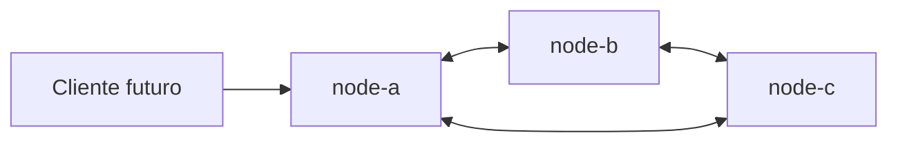
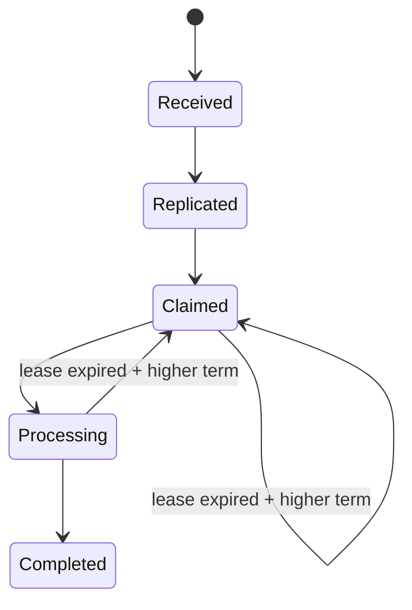

# SolidarityGrid

## Objetivo

SolidarityGrid será una red P2P de procesadores de pagos resilientes. El Slice 0
estableció su fundación técnica y el Slice 1 incorporó el dominio del pago, su
máquina de estados y las reglas de idempotencia. El Slice 2 aporta persistencia
SQLite durable e independiente por nodo. El Slice 3 expone una API pública
idempotente para crear y consultar pagos locales.

## Slices completados

- Slice 0: fundación .NET 8, nodos idénticos, Docker y automatización.
- Slice 1: agregado `Payment`, value objects, ownership, lease, term, eventos de
  dominio y política de idempotencia.
- Slice 2: SQLite local por nodo, migrations, rehidratación, idempotencia durable
  y concurrencia optimista.
- Slice 3: `POST /pay`, consulta por ID, replay durable y contratos Problem
  Details.

## Requisitos

- .NET 8 SDK.
- Docker.
- Docker Compose.

## Ejecución local

```bash
dotnet run --project src/SolidarityGrid.Node
```

## Ejecución con tres nodos

```bash
docker compose up --build
```

Docker Compose monta `node-a-data`, `node-b-data` y `node-c-data` en `/data`.
Aunque los tres contenedores usan el mismo nombre interno de archivo, sus
volúmenes son independientes.

## Endpoints iniciales

- node-a: <http://localhost:5101>
- node-b: <http://localhost:5102>
- node-c: <http://localhost:5103>

Cada nodo expone `/`, `/node`, `/health/live`, `/health/ready`, `POST /pay` y
`GET /payments/{paymentId}`.

## API pública

`POST /pay` recibe un pago y lo guarda localmente en estado `Received`.
`GET /payments/{paymentId}` consulta el recurso en el mismo nodo. Un identificador
que no cumple la constraint `:guid` no coincide con la ruta y retorna 404.

## Idempotency-Key

El header `Idempotency-Key` es obligatorio, opaco y case-sensitive. Repetir la
misma clave con el mismo amount y currency retorna el pago existente sin
modificarlo. Reutilizarla con otro payload retorna conflicto. La garantía local
proviene del índice único de SQLite, no solamente de una consulta previa.

## Ejemplos

Curl:

```bash
curl -i -X POST http://localhost:5101/pay \
  -H "Content-Type: application/json" \
  -H "Idempotency-Key: PAY-2026-0001" \
  -d '{"amount":150000,"currency":"COP"}'
```

PowerShell:

```powershell
$headers = @{ "Idempotency-Key" = "PAY-2026-0001" }
$body = @{ amount = 150000; currency = "COP" } | ConvertTo-Json
Invoke-RestMethod -Uri http://localhost:5101/pay `
    -Method Post -Headers $headers -ContentType application/json -Body $body
```

También puede ejecutarse la colección [SolidarityGrid.http](SolidarityGrid.http).

## Respuestas

- `202 Accepted`: pago creado.
- `200 OK`: replay compatible o consulta encontrada.
- `400 Bad Request`: header, payload o JSON inválido.
- `404 Not Found`: pago ausente en el nodo consultado.
- `409 Conflict`: clave reutilizada con otro payload.

Todos los errores del endpoint incluyen Problem Details con `code` y
`correlationId`.

## Script demo

Con los contenedores activos:

```powershell
.\scripts\demo-api.ps1
```

```bash
./scripts/demo-api.sh
```

## Persistencia local por nodo

Cada nodo escribe en su propio archivo SQLite; no existe una base central ni un
volumen compartido. Las conexiones activan WAL, foreign keys y un busy timeout
configurable. En ejecución local, la ruta predeterminada es
`src/SolidarityGrid.Node/data/solidarity-grid.db`; Docker usa
`/data/solidarity-grid.db` dentro del volumen privado de cada nodo.

## Idempotencia durable

`payments.idempotency_key` posee un índice único con collation `BINARY`. Las
claves son case-sensitive, por lo que `PAY-1` y `pay-1` pueden coexistir. Una
violación de unicidad se traduce a
`DuplicatePaymentIdempotencyKeyException`, sin filtrar tipos SQLite hacia
Application.

## Concurrencia optimista

`Payment.Version` es el único concurrency token y lo incrementa el dominio. Si
dos contextos cargan la misma versión, conserva el primer cambio confirmado y
el segundo recibe `PaymentConcurrencyException`.

## Migrations

La herramienta EF Core está fijada en el manifiesto local. Para restaurarla y
listar las migrations sin crear una base dentro del repositorio:

```powershell
dotnet tool restore
dotnet tool run dotnet-ef migrations list --project .\src\SolidarityGrid.Infrastructure --startup-project .\src\SolidarityGrid.Node --context SolidarityGridDbContext
```

La aplicación ejecuta `Database.MigrateAsync` antes de aceptar tráfico.

## Verificación

En Windows:

```powershell
.\scripts\local-ci.ps1
```

En Linux:

```bash
./scripts/local-ci.sh
```

Use `-BuildImage` en PowerShell o `--build-image` en Bash para construir también
la imagen.

## Arquitectura



La solución aplica Clean Architecture de forma pragmática. `SolidarityGrid.Node`
es el composition root; Domain permanece aislado y las capacidades técnicas se
ubicarán detrás de puertos de Application.

La máquina de estados implementada es:



La decisión completa está documentada en
[ADR 0002: Payment lifecycle and idempotency](docs/adr/0002-payment-lifecycle-and-idempotency.md).
El contrato público está documentado en
[ADR 0004: Idempotent payment HTTP API](docs/adr/0004-idempotent-payment-http-api.md).

## Limitación actual

La idempotencia es local por nodo. Todavía no existen replicación, gRPC,
heartbeats, procesamiento ni failover. Enviar la misma clave a otro nodo puede
crear una copia independiente; la convergencia se resolverá en un slice
posterior.

## Roadmap

- Comunicación directa entre peers.
- Detección de fallos y coordinación.
- Replicación, recuperación y observabilidad distribuida.
- Pipeline de demostración y pruebas de caos.

No se asocian fechas a estos slices; cada uno deberá conservar los límites de
arquitectura definidos aquí.
