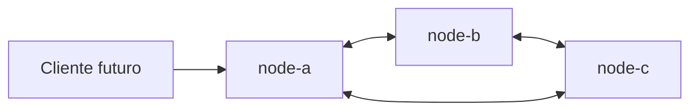

# SolidarityGrid

## Objetivo

SolidarityGrid será una red P2P de procesadores de pagos resilientes. Este Slice 0
establece únicamente su fundación técnica: una solución .NET 8 limpia, tres nodos
idénticos configurables y automatización reproducible.

## Requisitos

- .NET 8 SDK.
- Docker.
- Docker Compose.

## Ejecución local

```bash
dotnet run --project src/SolidarityGrid.Node
```

## Ejecución con tres nodos

```bash
docker compose up --build
```

## Endpoints iniciales

- node-a: <http://localhost:5101>
- node-b: <http://localhost:5102>
- node-c: <http://localhost:5103>

Cada nodo expone `/`, `/node`, `/health/live` y `/health/ready`.

## Verificación

En Windows:

```powershell
.\scripts\local-ci.ps1
```

En Linux:

```bash
./scripts/local-ci.sh
```

Use `-BuildImage` en PowerShell o `--build-image` en Bash para construir también
la imagen.

## Arquitectura



La solución aplica Clean Architecture de forma pragmática. `SolidarityGrid.Node`
es el composition root; Domain permanece aislado y las capacidades técnicas se
ubicarán detrás de puertos de Application.

En este slice todavía no existen pagos, replicación, heartbeats, leases ni
failover.

## Roadmap

- Contrato y ciclo de vida idempotente del pago.
- Persistencia local por nodo.
- Comunicación directa entre peers.
- Detección de fallos y coordinación.
- Replicación, recuperación y observabilidad distribuida.
- Pipeline de demostración y pruebas de caos.

No se asocian fechas a estos slices; cada uno deberá conservar los límites de
arquitectura definidos aquí.
