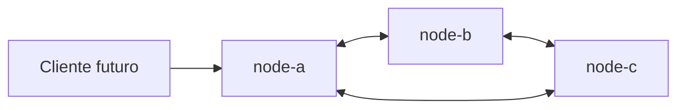
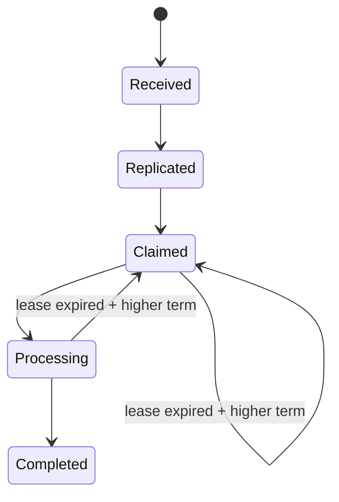

# SolidarityGrid

## Objetivo

SolidarityGrid será una red P2P de procesadores de pagos resilientes. El Slice 0
estableció su fundación técnica y el Slice 1 incorporó el dominio del pago, su
máquina de estados y las reglas de idempotencia. El Slice 2 aporta persistencia
SQLite durable e independiente por nodo. El Slice 3 expone una API pública
idempotente para crear y consultar pagos locales. El Slice 4 agrega transporte
mesh directo mediante gRPC. El Slice 5 incorpora el detector periódico de fallos
y el Slice 6 replica cada pago de forma durable hasta alcanzar quorum 2 de 3.

## Slices completados

- Slice 0: fundación .NET 8, nodos idénticos, Docker y automatización.
- Slice 1: agregado `Payment`, value objects, ownership, lease, term, eventos de
  dominio y política de idempotencia.
- Slice 2: SQLite local por nodo, migrations, rehidratación, idempotencia durable
  y concurrencia optimista.
- Slice 3: `POST /pay`, consulta por ID, replay durable y contratos Problem
  Details.
- Slice 4: contrato protobuf versionado, `Probe` gRPC, identidad de proceso,
  canales HTTP/2 reutilizables y diagnóstico de conectividad.
- Slice 5: heartbeats, estados de salud, recuperación y detección de reinicios.
- Slice 6: replicación gRPC durable e idempotente con quorum 2 de 3.

## Requisitos

- .NET 8 SDK.
- Docker.
- Docker Compose.

## Ejecución local

```bash
dotnet run --project src/SolidarityGrid.Node
```

## Ejecución con tres nodos

```bash
docker compose up --build
```

Docker Compose monta `node-a-data`, `node-b-data` y `node-c-data` en `/data`.
Aunque los tres contenedores usan el mismo nombre interno de archivo, sus
volúmenes son independientes.

## Endpoints iniciales

- node-a: <http://localhost:5101>
- node-b: <http://localhost:5102>
- node-c: <http://localhost:5103>

Cada nodo expone `/`, `/node`, `/health/live`, `/health/ready`, `POST /pay` y
`GET /payments/{paymentId}` en su puerto público HTTP/1.1. También expone
`GET /mesh/peers` para ejecutar un probe bajo demanda.

## Comunicación mesh

Los nodos se comunican directamente mediante gRPC sobre HTTP/2, sin broker ni
service mesh externo. Kestrel separa la API pública en el puerto interno `8080`
del transporte gRPC en `8081`. Docker publica únicamente `8080`; `8081` queda
expuesto solo dentro de la red de Compose.

Infrastructure mantiene un `GrpcChannel` reutilizable por URI de peer. Cada
probe tiene deadline, respeta cancelación y consulta los dos peers en paralelo,
sin retries automáticos.

## Probe

```http
GET /mesh/peers
```

La respuesta siempre contiene un resultado por peer. Una caída se representa
con `isReachable=false` y un código neutral como
`MESH_PEER_UNREACHABLE`, `MESH_DEADLINE_EXCEEDED`,
`MESH_PROTOCOL_MISMATCH` o `MESH_IDENTITY_MISMATCH`; no convierte la respuesta
completa en 500 ni afecta readiness.

## Heartbeats

Cada nodo ejecuta el RPC `Probe` periódicamente contra sus peers, sin retries y
sin broker. El intervalo predeterminado es 1000 ms. El ciclo siguiente comienza
solo cuando termina el anterior.

## Estados del detector

- `Unknown`: aún no existe evidencia suficiente.
- `Alive`: existe una observación válida reciente y no se superó el umbral de
  sospecha.
- `Suspected`: los fallos transitorios superaron 3000 ms.
- `Unreachable`: los fallos superaron 5000 ms o existe un error inmediato de
  identidad, protocolo o permisos.

Una falla aislada conserva `Alive`, pero incrementa sus contadores y expone el
último error. `Alive` no implica que la última llamada haya sido exitosa.

## Estado cacheado

`GET /mesh/peers` ejecuta probes activos bajo demanda. `GET /mesh/status` no
genera tráfico gRPC: devuelve los snapshots cacheados por el detector periódico.

El estado es local y efímero. Al reiniciar el monitor comienza otra vez en
`Unknown`. Un cambio de `InstanceId` remoto incrementa `RestartCount`, pero ese
contador no se persiste.

La salud de los peers no participa en `/health/ready`; un nodo con SQLite local
disponible continúa ready aunque uno o dos peers estén `Unreachable`.

## Identidad mesh

`NodeId` es estable y proviene de configuración. `InstanceId` se genera una vez
por proceso, permanece estable durante esa ejecución y cambia cuando el
contenedor reinicia. El cliente valida NodeId, InstanceId y versión de protocolo
de cada respuesta.

## Seguridad mesh

El PoC confía en la red interna de Docker. NodeId no es autenticación
criptográfica. En producción se requeriría mTLS o identidad de workload para
impedir la suplantación de NodeId.

## API pública

`POST /pay` guarda primero el pago localmente y luego intenta replicarlo.
`GET /payments/{paymentId}` consulta el recurso en el mismo nodo. Un identificador
que no cumple la constraint `:guid` no coincide con la ruta y retorna 404.

## Replicación

Cada pago se envía directamente por gRPC a los dos peers en paralelo, sin broker
y sin retries automáticos. El receptor responde solo después de guardar la misma
identidad, clave, amount, currency y timestamps en su SQLite local. Las réplicas
son idempotentes y quedan al menos en estado `Replicated`.

## Quorum

```text
node local + un peer con confirmación durable = quorum 2 de 3
```

No es necesario que los tres nodos confirmen. El estado del failure detector es
diagnóstico: siempre se intenta la llamada gRPC y el quorum utiliza el resultado
real del transporte.

`POST /pay` retorna `202 Accepted` para una creación solo cuando existe una
segunda copia durable. Sin confirmación remota retorna `503 Service Unavailable`;
el pago permanece localmente en `Received` y puede reintentarse con la misma
`Idempotency-Key`. Un replay que alcanza quorum retorna `200 OK`, conserva el
PaymentId y muestra estado `Replicated`, versión 2.

## Idempotency-Key

El header `Idempotency-Key` es obligatorio, opaco y case-sensitive. Repetir la
misma clave con el mismo amount y currency retorna el pago existente sin
modificarlo. Reutilizarla con otro payload retorna conflicto. La garantía local
proviene del índice único de SQLite, no solamente de una consulta previa.

## Ejemplos

Curl:

```bash
curl -i -X POST http://localhost:5101/pay \
  -H "Content-Type: application/json" \
  -H "Idempotency-Key: PAY-2026-0001" \
  -d '{"amount":150000,"currency":"COP"}'
```

PowerShell:

```powershell
$headers = @{ "Idempotency-Key" = "PAY-2026-0001" }
$body = @{ amount = 150000; currency = "COP" } | ConvertTo-Json
Invoke-RestMethod -Uri http://localhost:5101/pay `
    -Method Post -Headers $headers -ContentType application/json -Body $body
```

También puede ejecutarse la colección [SolidarityGrid.http](SolidarityGrid.http).

## Respuestas

- `202 Accepted`: pago creado.
- `200 OK`: replay compatible o consulta encontrada.
- `400 Bad Request`: header, payload o JSON inválido.
- `404 Not Found`: pago ausente en el nodo consultado.
- `409 Conflict`: clave reutilizada con otro payload.
- `503 Service Unavailable`: no existe una segunda copia durable; puede
  reintentarse con la misma clave.

Todos los errores del endpoint incluyen Problem Details con `code` y
`correlationId`.

## Script demo

Con los contenedores activos:

```powershell
.\scripts\demo-api.ps1
```

```bash
./scripts/demo-api.sh
```

Para demostrar conectividad mesh, aislamiento de una caída y cambio de
`InstanceId` al reiniciar `node-b`:

```powershell
.\scripts\demo-mesh.ps1
```

```bash
./scripts/demo-mesh.sh
```

Para demostrar la línea temporal `Alive → Suspected → Unreachable → Alive`:

```powershell
.\scripts\demo-heartbeats.ps1
```

```bash
./scripts/demo-heartbeats.sh
```

Para demostrar replicación normal, quorum con un peer caído, 503 sin quorum y
recuperación mediante replay:

```powershell
.\scripts\demo-replication.ps1
```

```bash
./scripts/demo-replication.sh
```

## Persistencia local por nodo

Cada nodo escribe en su propio archivo SQLite; no existe una base central ni un
volumen compartido. Las conexiones activan WAL, foreign keys y un busy timeout
configurable. En ejecución local, la ruta predeterminada es
`src/SolidarityGrid.Node/data/solidarity-grid.db`; Docker usa
`/data/solidarity-grid.db` dentro del volumen privado de cada nodo.

## Idempotencia durable

`payments.idempotency_key` posee un índice único con collation `BINARY`. Las
claves son case-sensitive, por lo que `PAY-1` y `pay-1` pueden coexistir. Una
violación de unicidad se traduce a
`DuplicatePaymentIdempotencyKeyException`, sin filtrar tipos SQLite hacia
Application.

## Concurrencia optimista

`Payment.Version` es el único concurrency token y lo incrementa el dominio. Si
dos contextos cargan la misma versión, conserva el primer cambio confirmado y
el segundo recibe `PaymentConcurrencyException`.

## Migrations

La herramienta EF Core está fijada en el manifiesto local. Para restaurarla y
listar las migrations sin crear una base dentro del repositorio:

```powershell
dotnet tool restore
dotnet tool run dotnet-ef migrations list --project .\src\SolidarityGrid.Infrastructure --startup-project .\src\SolidarityGrid.Node --context SolidarityGridDbContext
```

La aplicación ejecuta `Database.MigrateAsync` antes de aceptar tráfico.

## Verificación

En Windows:

```powershell
.\scripts\local-ci.ps1
```

En Linux:

```bash
./scripts/local-ci.sh
```

Use `-BuildImage` en PowerShell o `--build-image` en Bash para construir también
la imagen.

## Arquitectura



La solución aplica Clean Architecture de forma pragmática. `SolidarityGrid.Node`
es el composition root; Domain permanece aislado y las capacidades técnicas se
ubicarán detrás de puertos de Application.

La máquina de estados implementada es:



La decisión completa está documentada en
[ADR 0002: Payment lifecycle and idempotency](docs/adr/0002-payment-lifecycle-and-idempotency.md).
El contrato público está documentado en
[ADR 0004: Idempotent payment HTTP API](docs/adr/0004-idempotent-payment-http-api.md).
El transporte interno está documentado en
[ADR 0005: Direct gRPC mesh transport](docs/adr/0005-direct-grpc-mesh-transport.md).
El detector periódico está documentado en
[ADR 0006: Heartbeat failure detector](docs/adr/0006-heartbeat-failure-detector.md).
La replicación durable está documentada en
[ADR 0007: Durable payment replication](docs/adr/0007-durable-payment-replication.md).

## Limitación actual

No existe reconciliación histórica para un nodo que estuvo caído, procesamiento,
owner coordinado ni takeover. Solicitudes simultáneas con la misma clave en nodos
distintos antes de replicarse quedan fuera del escenario principal. El quorum de
replicación confirma durabilidad, pero todavía no es quorum de ownership.

## Roadmap

- Ownership, leases coordinadas y procesamiento idempotente.
- Recuperación, reconciliación y observabilidad distribuida.
- Pipeline de demostración y pruebas de caos.

No se asocian fechas a estos slices; cada uno deberá conservar los límites de
arquitectura definidos aquí.
