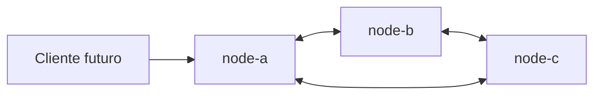
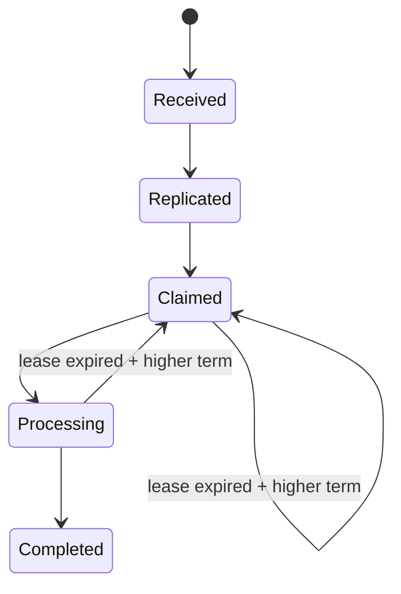

# SolidarityGrid

## Objetivo

SolidarityGrid será una red P2P de procesadores de pagos resilientes. El Slice 0
estableció su fundación técnica y el Slice 1 incorporó el dominio del pago, su
máquina de estados y las reglas de idempotencia.

## Slices completados

- Slice 0: fundación .NET 8, nodos idénticos, Docker y automatización.
- Slice 1: agregado `Payment`, value objects, ownership, lease, term, eventos de
  dominio y política de idempotencia.

## Requisitos

- .NET 8 SDK.
- Docker.
- Docker Compose.

## Ejecución local

```bash
dotnet run --project src/SolidarityGrid.Node
```

## Ejecución con tres nodos

```bash
docker compose up --build
```

## Endpoints iniciales

- node-a: <http://localhost:5101>
- node-b: <http://localhost:5102>
- node-c: <http://localhost:5103>

Cada nodo expone `/`, `/node`, `/health/live` y `/health/ready`.

## Verificación

En Windows:

```powershell
.\scripts\local-ci.ps1
```

En Linux:

```bash
./scripts/local-ci.sh
```

Use `-BuildImage` en PowerShell o `--build-image` en Bash para construir también
la imagen.

## Arquitectura



La solución aplica Clean Architecture de forma pragmática. `SolidarityGrid.Node`
es el composition root; Domain permanece aislado y las capacidades técnicas se
ubicarán detrás de puertos de Application.

La máquina de estados implementada es:



La decisión completa está documentada en
[ADR 0002: Payment lifecycle and idempotency](docs/adr/0002-payment-lifecycle-and-idempotency.md).

Todavía no existen persistencia, replicación real, comunicación entre peers ni
API de pagos. En particular, `POST /pay` no está implementado.

## Roadmap

- Persistencia local por nodo y API de recepción de pagos.
- Comunicación directa entre peers.
- Detección de fallos y coordinación.
- Replicación, recuperación y observabilidad distribuida.
- Pipeline de demostración y pruebas de caos.

No se asocian fechas a estos slices; cada uno deberá conservar los límites de
arquitectura definidos aquí.
