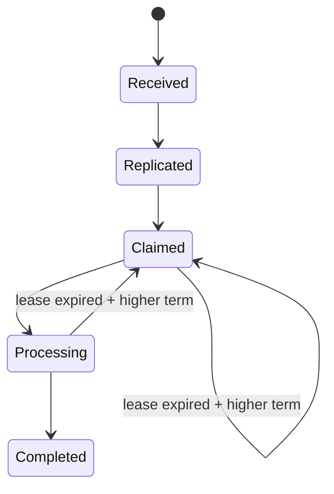

# Payment lifecycle and idempotency

## Context

SolidarityGrid needs a deterministic payment model before persistence,
replication, or node coordination can be introduced. The same logical payment
may be observed more than once, ownership may move between nodes, and messages
may be retried. The domain therefore needs explicit state, fencing information,
and idempotent transitions.

## Decision

`Payment` is the aggregate root for the distributed payment lifecycle. Its ID
and every operation timestamp are supplied by callers. The aggregate owns state
transitions, monotonic versioning, processing attempts, ownership, term, lease,
and domain-event collection.

The domain does not obtain quorum by itself. Application will decide when the
required replication condition has been reached and call `MarkReplicated`.

## Payment states

`Completed` is terminal. Cancellation, refunds, reversals, and compensation are
outside the current proof of concept.

## Idempotency key

`IdempotencyKey` is a case-sensitive opaque client token. Outer whitespace is
trimmed and the normalized value is limited to 128 characters. Application uses
the value together with the payment payload to distinguish replay from conflict.

## Money

`Money` contains a positive decimal amount and a three-letter currency
normalized to uppercase. It performs no conversion and has no currency-specific
scale rules in this slice.

## Ownership

The owner is the node currently allowed to process the payment for the active
term and lease. Ownership is represented by the `NodeId` value object and is
absent until the first successful claim.

## Term

Term is a monotonic fencing number. Every new claim or takeover must propose a
term strictly greater than the aggregate's current term.

## Lease

A lease is a temporary right to process until `LeaseExpiresAtUtc`. It must be
active when processing starts, when it is renewed, and when completion is
recorded. A lease does not prove that a node is dead; it only bounds how long an
ownership claim remains valid.

## Attempt

Attempt counts how many times processing actually started. Claim and renewal do
not increment it. Starting after a successful takeover increments it again.

## Version

Version starts at one and increases exactly once for every applied state
transition or lease renewal. Replays and rejected operations do not change it.
It is intended to support future replication conflict checks.

## Takeover

A takeover is allowed only from `Claimed` or `Processing`, after the current
lease expires, and with a strictly greater term. It returns the aggregate to
`Claimed` without incrementing Attempt.

## Idempotent transitions

Repeated replication, exact claim replay, repeated processing start, equal
lease renewal, and repeated completion are no-ops where defined. They return
`false`, preserve Version, and emit no domain event. Completion is therefore
idempotent inside the aggregate.

## Domain events

The aggregate records creation, replication, claim, processing start, lease
renewal, and completion events. Events include payment identity, UTC occurrence
time, and aggregate version. They are dequeued as an immutable snapshot and are
not published in this slice.

## Exactly-once limitations

The future system will target at-least-once processing with an idempotent
observable effect. Aggregate idempotency prevents duplicate domain transitions,
but it cannot guarantee absolute exactly-once behavior for external effects
such as a payment-provider call without cooperation from that external system.

## Alternatives considered

- A generic status setter was rejected because it cannot express transition
  invariants or idempotent replay semantics.
- Wall-clock access inside the aggregate was rejected because it makes tests
  nondeterministic and replicated decisions harder to reproduce.
- A boolean ownership flag was rejected because it cannot fence stale owners.
- Full consensus logic in Domain was rejected because quorum and communication
  belong to later application and infrastructure slices.

## Consequences

- Callers must supply payment IDs and UTC-capable timestamps.
- Application must coordinate quorum and decide when replication is sufficient.
- Future persistence must preserve all aggregate fields and versions.
- Future workers must treat term as a fencing token and lease as time-bounded,
  not as failure detection.
- Domain events remain in memory until a caller dequeues them.

## Status

Accepted.
