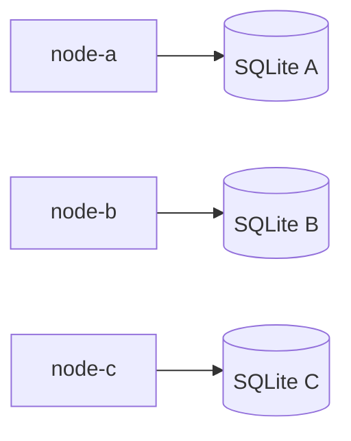

# Node-local SQLite persistence

## Context

SolidarityGrid needs durable state before nodes can accept or replicate
payments. A node must survive process restarts while preserving the aggregate's
identity, state, fencing data, monetary precision, and version. Persistence
must not introduce a central coordinator or leak database technology into
Domain or Application.

## Decision

Each node owns one SQLite 3 database configured by a file path and a validated
busy timeout. Infrastructure maps `Payment` directly with EF Core 8, applies
migrations at startup, and exposes repository and unit-of-work ports declared
by Application.

## Why one database per node

An independent database preserves node autonomy and allows a node to start,
stop, and recover its own durable state. Docker assigns a distinct named volume
to every node.

## Why not a shared database

A shared database would simplify consistency but would become a coordinator
and single failure domain, contradicting the intended peer-to-peer mesh.

## Aggregate mapping

Infrastructure maps `Payment` directly. Domain contains no EF Core references
or persistence attributes. The key is supplied externally and configured with
`ValueGeneratedNever`; state-machine invariants remain in Domain.

## Value objects

`IdempotencyKey` and nullable `NodeId` use explicit converters and value
comparers. `Money` is an owned value object stored in the `payments` table.

## Decimal representation

Amounts are stored as invariant-culture `TEXT` using the `G29` format and parsed
as `decimal`. No conversion to binary floating point occurs.

## UTC timestamps

All timestamps are normalized to UTC and stored as numeric .NET ticks in
`INTEGER` columns. This preserves sub-millisecond precision and supports
numeric filtering and ordering, including dates before 1970.

## Idempotency uniqueness

`idempotency_key` has a unique index and `BINARY` collation. Uniqueness is
therefore durable and case-sensitive. Infrastructure translates the stable
SQLite unique-constraint error to an Application exception.

## Optimistic concurrency

`Payment.Version` is both a domain version and the only EF Core concurrency
token. The domain increments it; the database does not generate it. A stale
writer receives a neutral `PaymentConcurrencyException`.

## WAL

File databases use write-ahead logging. Every opened SQLite connection also
enables foreign keys and applies the validated busy timeout.

## Migrations

The application invokes `Database.MigrateAsync` before serving traffic.
`EnsureCreated` and `EnsureDeleted` are not used. The local `dotnet-ef` tool and
the runtime packages share the same EF Core 8 patch version.

## Rehydration

A private parameterless `Payment` constructor exists solely for materializers.
It initializes the in-memory event collection through field initialization and
does not emit events, generate IDs, consult a clock, or replay transitions.

## Alternatives considered

- A central database was rejected because it violates mesh autonomy.
- SQLite in-memory was rejected as the primary integration-test store because
  it does not exercise file, WAL, reopen, or cleanup behavior.
- A duplicate persistence model was rejected because EF Core can map the
  aggregate without weakening its public invariants.
- Native SQLite floating-point storage was rejected for monetary amounts.
- Binary rowversion was rejected because the domain already owns `Version`.

## Consequences

- Node data is durable across container restarts while its named volume exists.
- Application depends only on persistence contracts and neutral exceptions.
- Optimistic concurrency prevents silent lost updates.
- Schema evolution must use migrations.
- File ownership and volume isolation are operational requirements.

## Limitations

There is no replication in this slice, so node databases can diverge.
Convergence will be addressed later. SQLite is storage, not a consensus
mechanism, and `Version` alone does not establish quorum or ownership across
nodes.

## Status

Accepted.
