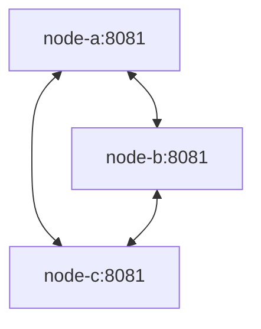

# Direct gRPC mesh transport

## Context

The three SolidarityGrid nodes currently accept and persist payments independently.
They need a small, explicit transport boundary before later slices can add failure
detection or replication. This slice needs connectivity diagnostics only.

## Decision

Use one versioned unary gRPC `Probe` RPC for direct node-to-node communication.
Contracts live in `SolidarityGrid.Contracts`, neutral ports in Application, the
client in Infrastructure, and the server and runtime configuration in Node.

There is no leader, broker, shared database, or coordination protocol.

## Why gRPC

Generated contracts, compact framing, HTTP/2 multiplexing, deadlines, cancellation,
and metadata make gRPC a suitable internal transport while keeping the public API
as HTTP/1.1 JSON.

## Why a separate internal port

Port `8081` is internal to the Docker network and accepts HTTP/2 gRPC traffic.
It is not published to the host. This avoids mixing the public trust boundary with
the node-to-node transport.

## Public HTTP and internal HTTP/2

Kestrel listens on `8080` with HTTP/1.1 for public endpoints and on `8081` with
HTTP/2 for gRPC. Compose publishes only `5101` through `5103` to public port
`8080`.

## Protocol versioning

`MeshProtocol.CurrentVersion` is `1`. A server rejects incompatible callers with
`FailedPrecondition`; clients translate that status to
`MESH_PROTOCOL_MISMATCH`. Protobuf field numbers remain stable.

## NodeId

`NodeId` is configured and stable. A server accepts only NodeIds present in its
immutable peer directory and rejects its own NodeId as a caller.

## InstanceId

Each process generates one non-persisted `InstanceId` through `IIdGenerator`.
It remains stable for that process and changes after a container restart. It does
not replace `NodeId`.

## Peer directory

Node converts `NodeOptions.Peers` once into neutral `MeshPeer` values. The
collection is immutable, excludes the local node, rejects duplicates, and contains
absolute internal URIs.

## Channel reuse

Infrastructure owns a thread-safe singleton pool with one `GrpcChannel` and
`SocketsHttpHandler` per configured URI. Channels are disposed with the host.

## Deadlines

Every probe has a configurable deadline, defaulting to 1000 ms and capped at
10000 ms. There are no retries or circuit breakers.

## Correlation ID

The HTTP request Correlation ID is forwarded as `x-correlation-id` gRPC metadata
and included in structured logging scopes on both client and server.

## Error translation

Infrastructure translates gRPC statuses into stable Application codes. One failed
peer produces a neutral result and does not fail the complete HTTP response.
Caller-requested cancellation is propagated instead of being presented as an
unreachable peer.

## Identity validation

The server validates the declared caller and protocol. The client validates the
responder NodeId, non-empty GUID InstanceId, and protocol version. A successful
RPC with unexpected identity is not healthy.

## Security boundary

The PoC trusts the internal Docker network. NodeId validation is not cryptographic
authentication. Production would require mTLS or workload identity to prevent
NodeId impersonation.

## Why no retries yet

Retries could duplicate future write operations and hide timing semantics needed
by coordination. They require an explicit policy in a later slice.

## Why no heartbeat yet

`Probe` runs only on demand through `GET /mesh/peers`. It does not maintain peer
state and is not a heartbeat or persistent failure detector.

## Why no payment replication yet

This slice establishes transport only. Payments remain node-local, and no payment
data appears in the protobuf contract or gRPC service.

## Alternatives considered

- HTTP/JSON between nodes: simpler inspection, but weaker generated contracts and
  less explicit HTTP/2 streaming evolution.
- A broker: rejected because it introduces external coordination and violates the
  direct P2P requirement.
- A shared database: rejected because it becomes a central coordinator.
- A full service mesh or Raft: excessive for the PoC and outside this slice.

## Consequences

Nodes can verify direct reachability and process identity without changing
readiness. HTTP/2 channels are reused and peer failures remain isolated. Operations
must account for h2c inside the trusted network and for the absence of
cryptographic peer authentication.

## Limitations

Reachable does not mean consensus. There is no leader, heartbeat, peer-state cache,
replication, quorum, processing, failover, or recovery. A declared NodeId can be
spoofed without mTLS. The InstanceId enables restart observation but does not yet
drive any automatic behavior.

## Status

Accepted.
