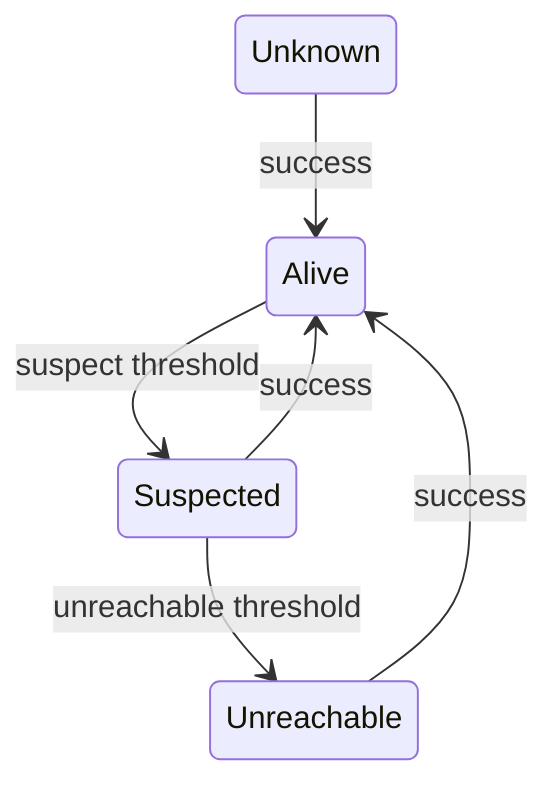

# Heartbeat failure detector

## Context

Direct gRPC probes exist, but a manual probe is not a durable observation of peer
health. Later coordination needs a conservative, explicit signal without making
payment decisions.

## Decision

Run the existing `Probe` periodically and maintain immutable in-memory snapshots
per configured peer.

## Reusing Probe

No RPC is added. Periodic observation calls the existing version-1 `Probe`.

## Periodic observation

A singleton `BackgroundService` observes immediately, then waits for the configured
interval. Cycles never overlap and unexpected exceptions do not prevent later cycles.

## Unknown

Every peer starts `Unknown` with version and counters at zero.

## Alive

A valid response establishes `Alive`. An isolated transient failure may leave this
status until the suspicion threshold is crossed.

## Suspected

Transient failures beyond the suspicion threshold produce `Suspected`.

## Unreachable

Continued transient failures beyond the unreachable threshold, or an immediate
identity, protocol, or permission failure, produce `Unreachable`.

## Why one failure is insufficient

Latency spikes and brief network loss are normal. A single transient timeout records
evidence but does not declare a peer unreachable.

## Time-based thresholds

Defaults are a 1000 ms interval, suspicion after 3000 ms, and unreachable after
5000 ms. Elapsed time is based on the last success or monitoring start.

## Transient failures

Unreachable transport, deadline, and generic RPC failures advance through
time-based states.

## Immediate trust failures

Protocol mismatch, identity mismatch, and permission denial become `Unreachable`
immediately because waiting cannot repair incompatible trust or configuration.

## Recovery

Any valid response returns the peer to `Alive`, resets consecutive failures, and
clears the last error.

## Restart detection

A changed non-empty InstanceId records a restart and increments a local counter.
The first observed InstanceId is not a restart.

## NodeId and InstanceId

NodeId is configured identity. InstanceId identifies one process lifetime.

## Thread-safe in-memory registry

A small lock replaces complete immutable snapshots atomically. Readers receive
read-only snapshot collections.

## Why state is not persisted

Health is local, current evidence. Restarting a monitor intentionally resets it to
`Unknown`; stale health must not survive in SQLite.

## Readiness independence

Peer health never affects local readiness. A node remains ready when peers are
suspected, unreachable, or restarting.

## Logging

Structured events record suspicion, unreachability, recovery, restart, cycle
failures, and correlation IDs without logging expected timeout stack traces.

## Network partitions

A partition is observationally indistinguishable from a stopped process from one
node's perspective.

## Failure detector limitations

`Unreachable` does not prove that a process is dead. The detector emits a signal;
it never authorizes payment takeover.

## Alternatives considered

Persisted health was rejected as stale. A single-failure detector was rejected as
noisy. SWIM and phi-accrual detection were rejected as unnecessary complexity.

## Consequences

Each node obtains deterministic local health and restart evidence. Future slices
may combine that evidence with expired leases and quorum, but must not treat it as
consensus by itself.

## Status

Accepted.
